# 🚀 RAG Techniques - Complete Jupyter Notebook Collection

A comprehensive collection of **37 RAG (Retrieval-Augmented Generation) techniques** implemented as fully functional Jupyter notebooks with centralized configuration management.


## 📋 Table of Contents

- [Overview](#overview)
- [Architecture](#architecture)
- [Project Structure](#project-structure)
- [Setup Instructions](#setup-instructions)
- [RAG Techniques Included](#rag-techniques-included)
- [Configuration](#configuration)
- [Usage](#usage)
- [Vector Database Support](#vector-database-support)
- [Comparison with Other Projects](#comparison-with-other-projects)
- [Troubleshooting](#troubleshooting)

## 🎯 Overview

This repository provides production-ready implementations of advanced RAG techniques, each in its own folder with:

- ✅ **Fully functional Jupyter notebooks**
- ✅ **Centralized .env configuration**
- ✅ **Multiple vector database support** (Pinecone, Weaviate, Qdrant, Milvus, ChromaDB, FAISS)
- ✅ **Helper utilities and functions**
- ✅ **Sample data and resources**
- ✅ **Individual README for each technique**

## 🏗️ Architecture

### **High-Level RAG Pipeline**

```
┌─────────────┐
│   Query     │
└──────┬──────┘
       │
       ▼
┌─────────────────────────────────────┐
│  Query Processing & Enhancement     │
│  • HyDE / HyPE                      │
│  • Query Transformations            │
└──────┬──────────────────────────────┘
       │
       ▼
┌─────────────────────────────────────┐
│     Document Retrieval              │
│  • Vector Search                    │
│  • Fusion Retrieval                 │
│  • Graph-based Retrieval            │
└──────┬──────────────────────────────┘
       │
       ▼
┌─────────────────────────────────────┐
│    Post-Retrieval Processing        │
│  • Reranking                        │
│  • Context Enrichment               │
│  • Contextual Compression           │
└──────┬──────────────────────────────┘
       │
       ▼
┌─────────────────────────────────────┐
│      Response Generation            │
│  • Simple RAG                       │
│  • Self-RAG (Self-Reflection)       │
│  • CRAG (Corrective)                │
│  • Agentic RAG                      │
└──────┬──────────────────────────────┘
       │
       ▼
┌─────────────┐
│  Response   │
└─────────────┘
```

📖 **For detailed architecture diagrams and workflows, see [ARCHITECTURE.md](./ARCHITECTURE.md)**

### **What Makes This Collection Unique**

| Feature | Description |
|---------|-------------|
| 🎯 **Comprehensive** | 37 different RAG techniques covering basic to advanced patterns |
| 🏗️ **Production-Ready** | Centralized configuration, error handling, logging |
| 🔧 **Flexible** | 6 vector database options with easy switching |
| 📚 **Educational** | Each technique documented with README and examples |
| 🚀 **Advanced Patterns** | RAPTOR, Graph RAG, Multimodal, Agentic workflows |
| 🔄 **Dual Framework** | Both LangChain and LlamaIndex implementations |

### **Visual Architecture Examples**

<details>
<summary><b>🔍 CRAG (Corrective RAG)</b> - Self-correcting retrieval with confidence scoring</summary>



Automatically grades retrieved documents and triggers web search when confidence is low.
</details>

<details>
<summary><b>🔄 Self-RAG</b> - Self-reflection and quality assessment</summary>



Evaluates both document relevance and answer quality through self-reflection.
</details>

<details>
<summary><b>🕸️ Graph RAG</b> - Knowledge graph-based retrieval</summary>



Constructs and queries knowledge graphs for relationship-aware retrieval.
</details>

<details>
<summary><b>🔀 Fusion Retrieval</b> - Multiple retrieval strategies combined</summary>



Combines vector search, keyword search, and graph traversal using reciprocal rank fusion.
</details>

<details>
<summary><b>🌳 RAPTOR</b> - Recursive abstractive processing</summary>



Builds hierarchical document trees for multi-level retrieval from summaries to details.
</details>

<details>
<summary><b>🔁 Hierarchical Indices</b> - Multi-level document organization</summary>



Organizes documents in hierarchical structures for efficient navigation and retrieval.
</details>

**📸 [See all 29 architecture diagrams in the images/ folder](./images/)**

## 📁 Project Structure

```
RAG_Techniques_Notebooks/
├── .env                          # Your API keys and configuration (create from template)
├── .env.template                 # Template for environment variables
├── README.md                     # This file
├── requirements.txt              # All Python dependencies
├── convert_notebooks.py          # Conversion script (already run)
│
├── utils/                        # Shared utilities
│   ├── __init__.py
│   ├── env_loader.py            # Environment loading utilities
│   └── helper_functions.py      # Helper functions for RAG operations
│
├── data/                         # Shared data files
│   └── [sample PDFs and datasets]
│
├── images/                       # Diagrams and visualizations
│   └── [technique diagrams]
│
└── notebooks/                    # Individual technique implementations
    ├── simple_rag/
    │   ├── simple_rag.ipynb
    │   └── README.md
    ├── Agentic_RAG/
    │   ├── Agentic_RAG.ipynb
    │   └── README.md
    ├── graph_rag/
    │   ├── graph_rag.ipynb
    │   └── README.md
    └── [... 34 more techniques]
```

## 🛠️ Setup Instructions

### 1. Prerequisites

- Python 3.10 or higher
- pip or conda package manager
- Jupyter Notebook or JupyterLab
- API keys for OpenAI and your chosen vector database

### 2. Installation

```bash
# Clone or navigate to the project directory
cd RAG_Techniques_Notebooks

# Create a virtual environment (recommended)
python -m venv venv

# Activate virtual environment
# On Windows:
venv\Scripts\activate
# On macOS/Linux:
source venv/bin/activate

# Install dependencies
pip install -r requirements.txt
```

### 3. Configure Environment Variables

```bash
# Copy the template
cp .env.template .env

# Edit .env with your favorite editor
nano .env  # or vim, code, etc.
```

**Required configuration:**
- `OPENAI_API_KEY`: Your OpenAI API key
- Vector database credentials (choose at least one)
- Other optional API keys based on techniques you want to use

### 4. Start Jupyter

```bash
# Option 1: Jupyter Lab (recommended)
jupyter lab

# Option 2: Jupyter Notebook
jupyter notebook
```

## 📚 RAG Techniques Included

### Basic RAG
1. **Simple RAG** - Basic retrieval-augmented generation
2. **Simple RAG with LlamaIndex** - RAG using LlamaIndex framework
3. **Simple CSV RAG** - RAG for CSV data
4. **Simple CSV RAG with LlamaIndex** - CSV RAG using LlamaIndex

### Advanced Retrieval
5. **Fusion Retrieval** - Combines multiple retrieval strategies
6. **Fusion Retrieval with LlamaIndex** - Fusion approach using LlamaIndex
7. **Adaptive Retrieval** - Dynamic retrieval strategy selection
8. **Hierarchical Indices** - Multi-level indexing for better retrieval

### Query Enhancement
9. **HyDE (Hypothetical Document Embedding)** - Generate hypothetical answers for better retrieval
10. **HyPE (Hypothetical Prompt Embeddings)** - Hypothetical prompt generation
11. **Query Transformations** - Transform queries for better results

### Context Enhancement
12. **Context Enrichment Window Around Chunk** - Add surrounding context to chunks
13. **Context Enrichment with LlamaIndex** - Context enrichment using LlamaIndex
14. **Contextual Chunk Headers** - Add contextual headers to chunks
15. **Contextual Compression** - Compress context intelligently

### Chunking Strategies
16. **Choose Chunk Size** - Optimal chunk size selection
17. **Semantic Chunking** - Chunk by semantic meaning
18. **Proposition Chunking** - Chunk by logical propositions

### Reranking
19. **Reranking** - Rerank retrieved documents
20. **Reranking with LlamaIndex** - Reranking using LlamaIndex

### Advanced RAG Patterns
21. **CRAG (Corrective RAG)** - Self-correcting retrieval
22. **Self-RAG** - Self-reflective RAG
23. **Reliable RAG** - High-reliability retrieval patterns
24. **Retrieval with Feedback Loop** - Iterative retrieval refinement
25. **Dartboard** - Multi-level precision retrieval

### Graph-Based RAG
26. **Graph RAG** - Knowledge graph-based retrieval
27. **Microsoft GraphRAG** - Microsoft's GraphRAG implementation
28. **GraphRAG with Milvus** - Graph RAG using Milvus vector DB

### Agent-Based RAG
29. **Agentic RAG** - LLM agents for RAG orchestration

### Document Processing
30. **Document Augmentation** - Enhance documents before indexing
31. **Relevant Segment Extraction** - Extract most relevant segments
32. **JSON RAG** - RAG for JSON data structures

### Advanced Techniques
33. **RAPTOR** - Recursive abstractive processing
34. **MemoRAG** - Memory-augmented RAG
35. **Explainable Retrieval** - Interpretable retrieval decisions

### Multimodal RAG
36. **Multi-Model RAG with Captioning** - Image+text RAG with captions
37. **Multi-Model RAG with ColPali** - Advanced multimodal retrieval

## ⚙️ Configuration

### Environment Variables

The `.env` file contains all configuration. Key sections:

#### OpenAI Configuration
```bash
OPENAI_API_KEY=sk-...
DEFAULT_LLM_MODEL=gpt-4
DEFAULT_EMBEDDING_MODEL=text-embedding-ada-002
```

#### Vector Database Selection
```bash
VECTOR_DB_PROVIDER=pinecone  # or: weaviate, qdrant, milvus, chroma, faiss
```

#### Vector Database Credentials

**Pinecone:**
```bash
PINECONE_API_KEY=your-key
PINECONE_ENVIRONMENT=your-env
PINECONE_INDEX_NAME=rag-techniques
```

**Weaviate:**
```bash
WEAVIATE_URL=https://your-instance.weaviate.network
WEAVIATE_API_KEY=your-key
```

**Qdrant:**
```bash
QDRANT_URL=https://your-instance.qdrant.tech
QDRANT_API_KEY=your-key
```

**Milvus/Zilliz:**
```bash
ZILLIZ_CLOUD_URI=https://your-instance.zilliz.com
ZILLIZ_CLOUD_API_KEY=your-key
```

## 🎮 Usage

### Running a Notebook

1. Navigate to the technique folder:
```bash
cd notebooks/simple_rag
```

2. Open the notebook in Jupyter Lab/Notebook

3. Run all cells - the environment will be automatically loaded!

### Environment Loading

Each notebook automatically:
- ✅ Loads variables from the centralized `.env` file
- ✅ Validates required API keys
- ✅ Displays current configuration
- ✅ Sets up helper functions
- ✅ Configures paths to shared resources

Example from any notebook:
```python
from utils.env_loader import load_environment, check_required_keys

# Automatically loads .env
load_environment()

# Checks if OpenAI key is set
check_required_keys('OPENAI_API_KEY')
```

## 🗄️ Vector Database Support

All notebooks support multiple vector databases:

| Database | Setup Difficulty | Cloud Option | Self-Hosted | Best For |
|----------|-----------------|--------------|-------------|----------|
| **FAISS** | Easy | No | Yes | Development, Testing |
| **Pinecone** | Easy | Yes | No | Production, Managed |
| **Weaviate** | Medium | Yes | Yes | Hybrid Search |
| **Qdrant** | Medium | Yes | Yes | Performance |
| **Milvus/Zilliz** | Medium | Yes | Yes | Scale, Features |
| **ChromaDB** | Easy | No | Yes | Local Development |

### Switching Vector Databases

Simply update your `.env` file:
```bash
VECTOR_DB_PROVIDER=qdrant  # Change to your preferred DB
```

## 🔧 Troubleshooting

### API Key Issues
```python
# Check which keys are missing
from utils.env_loader import check_required_keys
check_required_keys('OPENAI_API_KEY', 'PINECONE_API_KEY')
```

### Import Errors
```bash
# Reinstall dependencies
pip install -r requirements.txt --upgrade
```

### Path Issues
The notebooks automatically adjust paths. If you encounter issues:
```python
# Check current configuration
from utils.env_loader import display_config
display_config()
```

### Vector Database Connection Issues

1. **Verify credentials** in `.env`
2. **Check network connectivity**
3. **Verify instance/index exists**
4. **Try FAISS** for local testing (no credentials needed)

## 📝 Adding Your Own Vector DB Credentials

When you're ready to use the notebooks:

1. Open `.env` file
2. Add your credentials for your chosen vector database
3. Set `VECTOR_DB_PROVIDER` to match your database
4. Save and restart your Jupyter kernel

Example for Pinecone:
```bash
OPENAI_API_KEY=sk-proj-xxxxxxxxxxxxx
PINECONE_API_KEY=pcsk_xxxxxxx
PINECONE_ENVIRONMENT=us-west1-gcp
PINECONE_INDEX_NAME=rag-techniques
VECTOR_DB_PROVIDER=pinecone
```

## 🎓 Learning Path

Recommended order for learning:

1. **Start with basics**: `simple_rag` → `simple_rag_with_llamaindex`
2. **Improve chunking**: `choose_chunk_size` → `semantic_chunking`
3. **Better retrieval**: `fusion_retrieval` → `reranking`
4. **Advanced patterns**: `CRAG` → `self_rag` → `Agentic_RAG`
5. **Specialized**: `graph_rag`, `multimodal`, etc.

## 📊 Comparison with Other Projects

### **vs Advanced_RAG Repository**

| Aspect | This Project | Advanced_RAG |
|--------|--------------|--------------|
| **Techniques** | 37 techniques | ~10 techniques |
| **Infrastructure** | 6 vector DBs, centralized config | Langchain-focused |
| **Unique Features** | RAPTOR, Multimodal, MemoRAG, Explainability | Local LLAMA 3 emphasis |
| **Documentation** | Individual READMEs + Architecture docs | Notebook-based |
| **Production Ready** | ✅ Complete setup | ⚠️ Basic |

**What we have that Advanced_RAG doesn't:**
- ✅ Comprehensive chunking strategies (3 types)
- ✅ Context enhancement suite (4 techniques)
- ✅ RAPTOR (recursive abstractive processing)
- ✅ Multimodal RAG (2 implementations)
- ✅ MemoRAG (memory-augmented)
- ✅ Explainable retrieval
- ✅ Dual framework support (LangChain + LlamaIndex)

**What Advanced_RAG has that we could add:**
- ⚠️ Local LLAMA 3 implementation (easily added)
- ⚠️ Adaptive Agentic RAG (enhancement to our Agentic RAG)

📖 **For detailed comparison, see [COMPARISON_WITH_ADVANCED_RAG.md](./COMPARISON_WITH_ADVANCED_RAG.md)**

### **Migration from Other Projects**

If you're coming from other RAG implementations:

| Your Background | Start Here |
|-----------------|------------|
| **Advanced_RAG** | See our [comparison guide](./COMPARISON_WITH_ADVANCED_RAG.md) for concept mapping |
| **LangChain RAG** | Check our LlamaIndex implementations for comparison |
| **LlamaIndex RAG** | Check our LangChain implementations for comparison |
| **Basic RAG** | Start with `simple_rag` and progressively explore advanced techniques |

## 📄 License

Based on the original RAG Techniques repository. Check individual technique folders for specific licensing information.

## 🤝 Contributing

Feel free to:
- Report issues
- Suggest improvements
- Add new techniques
- Share your configurations

## 📧 Support

For issues:
1. Check the technique-specific README
2. Review the troubleshooting section
3. Check your `.env` configuration
4. Verify all dependencies are installed

## 🌟 Credits

Original techniques and implementations from the RAG Techniques repository.
Centralized configuration and organization by this project.

---

**Ready to start?** Choose a technique from the `notebooks/` folder and begin exploring! 🚀
